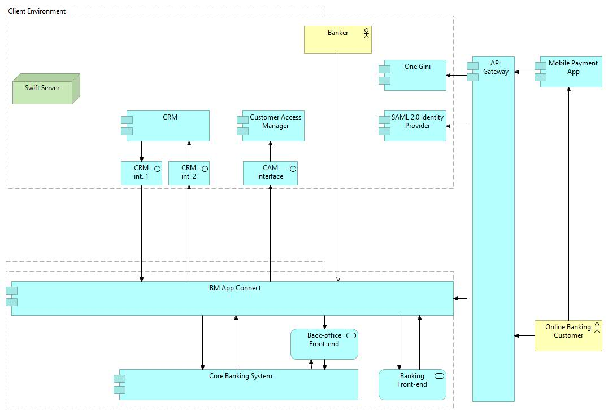
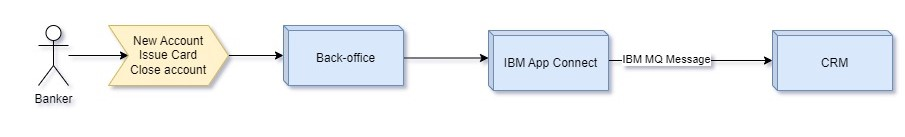
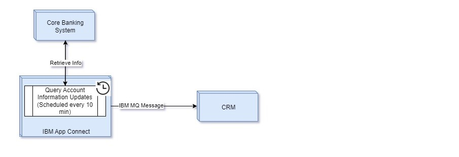
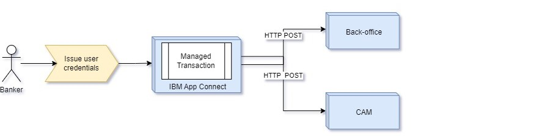

# Ocean Bank Architecture
1. [Introduction](#introduction)
1.1. [Scope](#scope)
1.2. [System Context](#context)
2. [Architectural Constraints](#constraints)
3. [Non-functional Requirements](#n-f-requirements)
3.1. [Security](#security)
4. [Use Cases](#usecases)
4.1. [Create new customer](#new-customer)
4.2. [Create New Account / Issue Cards](#new-account)
4.3. [Query Account Information Updates](#account-information)
4.4. [Issue User Credentials](#issue-credentials)

## Introduction
Ocean Bank is a small regional bank based in the Gulf States of UAE and Oman. Although the bank offers services for private clients and small businesses, it specializes in financial services for Oil &Gas cooperatives. The Federation has recently passed legislation to lower barriers to the entrance to its financial sector, in order to decrease the prices of banking services for its citizens, and improve the protection of consumers paying online. This creates pressure on the banks to adjust their banking systems to be compliant with the new laws. The Bank has relied on an external vendor to provide and operate their banking systems for current and savings accounts since the 1990s. The maintenance cost of the current systems is already very high, and when the vendor was asked for a cost estimate for the required changes to the systems, the presented quotation was staggeringly high.

#### 1.1. Scope
Complete the solution to integrate with the client according to the requirements, adding another digital channel to streamline the new modernized channels such as e-Services, Mobile App, Chatbot, and/or any channel.

#### 1.2. System Context
 - Use IBM App Connect as ESB and API management system at the core of our solution.
 - All integrations, API calls, and triggers will walkthrough IBM App Connect.
 

### Architectural Constraints
- The core banking systems are productized and you cannot change them. 
- The only way to retrieve information from these systems is by querying the APIs. 
- The core does not provide any push notifications nor can you “subscribe” to events.

### Non-functional Requirements

#### 1.1. Security
By applying the security zero-trust concept:
1. All communications between datacenters will be via VPN.
2. Use TLS protocols for all API calls.

### 4. Use Cases

#### 4.1. Create new customer

#### 4.2. Create New Account / Issue Cards

#### 4.3. Query Account Information Updates

#### 4.4. Issue User  Credentials

